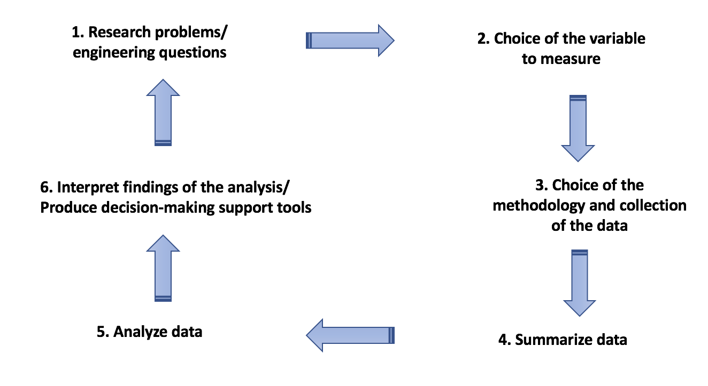

Statistical concepts will be taught during lectures and applied weekly during computer laboratory sessions. During computer labs hours, *six labs summary* and *four lab reports* will be completed by students. The purpose of these laboratory sessions is to apply statistical concepts and R codes using real-world data and to produce high-quality visualizations. 
All lab assignments are organized to follow the procedures usually applied in research:

Because this course is an introduction to statistics, the research problems/engineering questions (1), the choice of the variable to measure (2), as well as the determination of the methodology and the collection of data (3) are given in background. **Background information is essential for students to understand the purpose** and the reason they conduct statistical analysis on data. Also, the use of relevant real-data to students'fields of education creates a dynamic environment where they can find a growing interest in learning statistics. 
 

### **Lab summaries**

Through the course semester, six lab summaries will be completed. Each lab summaries used real datasets collected online or from researchers. Students are guided to organize and visualize data. Each assignment reports:

* The source of the data.
* The method used to collect data.
* The purpose of the data collection.
* Questions that need to be answered by students after analyzing data. 

The six lab summaries can be accessed below:

1. *Summary 1*: [**Exploratory Data Analysis**](file:///Applications/Stattistic%20class/Problem%20sessions/Problem%20session%201%20-%20Exploratory%20Data%20Analysis-20180509/Session1-EDA.html). The dataset analysed is the Air Quality Index (AQI) values measured in 2017 accross over 800 counties in the United States are presented. This assignment allow students to explore large datasets and applied basic visualization techniques with R. 

2. *Summary 2*: [**Data visualization with ggplot2**](). The dataset analyzed was curated by the Food and Agricultural Organization (FAO) of the United Nations through the FAOSTAT program. Students will evaluate 
sweet potato yield (hectogram/hectare), area harvested (hectares), and production quantity (tons) globally.

3. *Summary 3*: [**Importing and Cleaning Data**](). The dataset analysed was collected in 2011 and 2012 as part of a study lead by Dr. Anders Huseth (Entomology and Plant Pathology, NCSU) and Dr. Russell Groves (Entomology, UW-Madison). In this assignment, students will analyse the neonicotinoid datasets to investigate which applixation strategy and active ingredient in pestices contribute the most to the groundwater quality degradation. 

4. *Summary 4*:[**Data wrangling**](). Data analyzed are from the Department of the Interior (US Geological Survey and Bureau of Reclamation) and include flow (cfs) measurements from three locations along the Colorado River: Lake Powell, Lees Ferry, and the US-Mexico border.  Students will analyse hydrologic data from the Colorado River system. 

5. *Summary 5*:[**R check-in**](). Data analyzed are from the US Geological Survey and include total nitrogen (N) and phosphorus (P) mass (kg) applied to the land surface in 1987 via fertilizer(applied to farm and non-farm settings), livestock (confined and unconfined) manure, and atmospheric deposition (N only). Students will reorganize and group data by variables to create high quality plots. 

6. *Summary 6*: [**R check-in part 2, calculating quantiles**](). Data analyzed  are from the NOAA National Estuarine Research Reserve’s System Wide Monitoring Program and include water depth (m), dissolved oxygen (mg/L), salinity in practical salinity units, and water temperature (°C). During one year, data were measured every 15 minutes. Students will reorganize and group data by variables to create high quality plots. In addition, they are expected to plot cumulative distribution functions and  Q-Q plots of the observed data. 

### **Lab reports**

About two months after the beginning of the semester, students should have acquired enough R computing skills to be independent in their statistical analysis. *Four lab reports* will be completed. For each of the report it is expected that students produce a technical report including the following questions:

1. Abstract
2. Introduction
3. Methods
4. Results
5. Recommendations

During these assignments, students play the role of engineers hired in a firm. Students should answer and solve research questions using statistical concepts and R codes learned during lectures hours and lab summaries, respectively. As for the lab summaries, only real data are used. The four lab reports can be accessed below:

1. *Lab report 1*: [** Distribution **](). 

2. *Lab report 2*: [** Stochastic Rainfall Simulation **](). 

3. *Lab report 3*: [** Hypothesis testing **](). 

4. *Lab report 4*: [** Linear regression **](). 