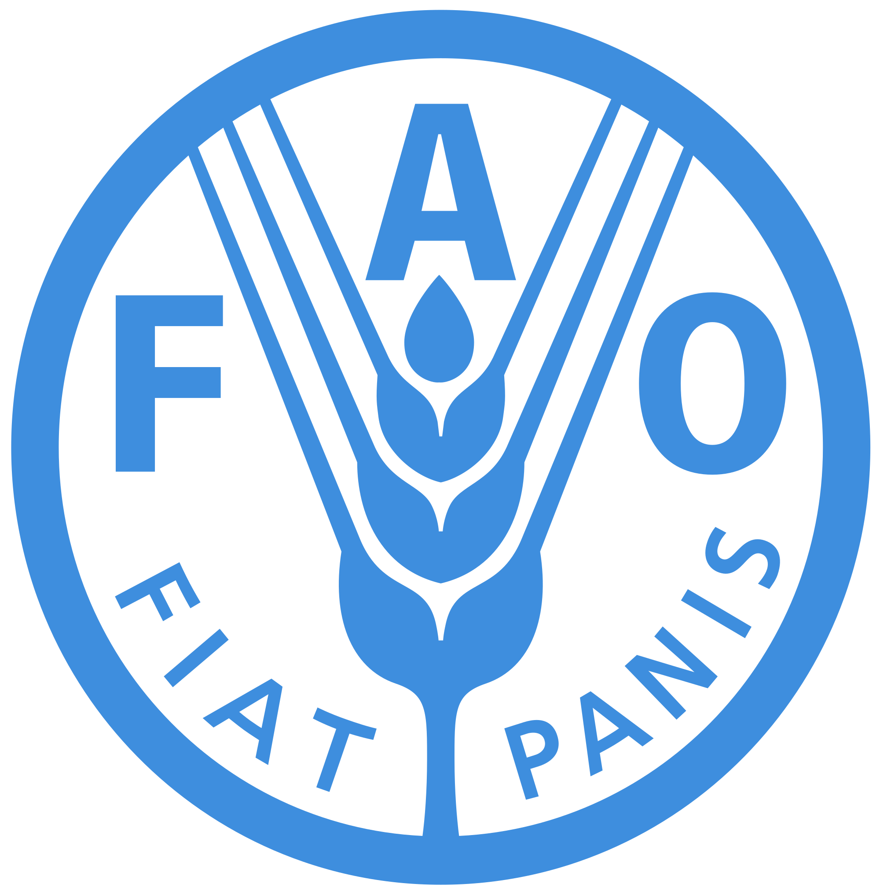

**Biomass Energy Feedstock Library – compositions of many different agricultural feedstocks (includes % glucane from cellulose and starch, % xylan, % lignin, % total ash, % protein)**

* **Web**: https://bioenergylibrary.inl.gov/Home/Home.aspx
* **Additional notes**: Dr. Nelson has these data in a spreadsheet; contact her directly if you would like to use these data [here](http://nelson.rbind.io).
  

  

  
**FAOSTAT - food and agriculture data (huge variety) for over 245 countries and territories**

* **Spatial resolution**: country
* **Temporal resolution**: annual, 1961-2017 and covers all FAO regional groupings from 1961 to the most recent year available
* **Web**: http://www.fao.org/faostat/en/#data 
* **Additional notes**: Datasets in FAOSTAT include crop,livestock, and forestry production, agricultural inputs, agricultural emissions, and a large suite of agri-environmental indicators (fertilizer, pesticides, temperature change, etc.), among others.

  
**North Carolina Department of Agriculture & Consumer Service’s Agricultural Water Use Data – agricultural water use data in gallons**

* **Spatial resolution**: state
* **Temporal resolution**: monthly
* **Web**: http://www.ncagr.gov/stats/environmental/index.htm
* **Additional notes**: data are in PDF reports
   

  

**NOAA Fisheries Annual Commercial Landings – total annual landings of commercial fish and shellfish species in the US in terms of dollars and pounds**

* **Spatial resolution**: state (or all of US)
* **Temporal resolution**: annual
* **Web**: https://www.st.nmfs.noaa.gov/commercial-fisheries/commercial-landings/annual-landings-with-group-subtotals/index

   
**USDA Census of Agriculture – a comprehensive summary of agricultural activity in the US**

* **Spatial resolution**: state, county, watershed, American Indian reservation
* **Temporal resolution**: every 5 years, 1840-2012
* **Web**: https://www.agcensus.usda.gov/Publications/2012/   
           https://www.nass.usda.gov/Data_and_Statistics/index.php 
* **Additional notes**: Includes “Special Studies,” such as the 2013 Census of Aquaculture and 2013 Farm and Ranch Irrigation Survey, among others

**USDA Long-Term Agricultural Projections – expected changes in a variety of US commodities through 2027**

* **Spatial resolution**: nation
* **Temporal resolution**: 2017-2027
* **Web**:http://usda.mannlib.cornell.edu/MannUsda/viewDocumentInfo.do?documentID=1192
     

**USDA World Agricultural Supply and Demand Estimates – estimated supply and demand for a variety of commodities Spatial resolution: US and world**

* **Temporal resolution**: annual
* **Web**: https://www.usda.gov/oce/commodity/wasde/index.htm
* **Additional notes**: The data are divided onto multiple sheets in the Excel file
 
 
**USDA Forest Service Forest Health – forest acres damaged (defoliation and mortality) by pests across the US Spatial resolution: state or region**

* **Temporal resolution**: annual, 2013-2016
* **Web**: https://foresthealth.fs.usda.gov/portal/PestSummary/DamageSummary   
    

