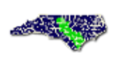
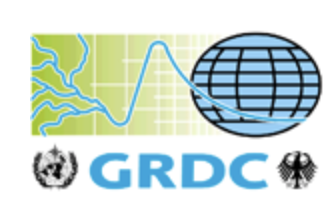
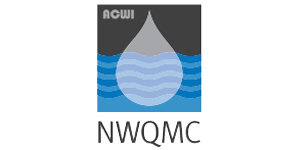

**Cape Fear River Basin Monitoring Coalitions’ Water Quality Data – water quality measurements for several locations along the Lower Cape Fear River**

* **Spatial resolution**: point
* **Temporal resolution**: monthly
* **Web**: http://lcfrp.uncw.edu/riverproject/

        

**EPA National Air Emissions Monitoring Study – air quality and emissions data from select animal feeding operations in CA, IA, IN, KY, NC, NY, OK, TX, WA, and WI**

* **Spatial resolution**: point
* **Temporal resolution**: varies by location
* **Web**: https://archive.epa.gov/airquality/afo2012/web/html/index.html

**EPA Toxics Release Inventory – reported releases of toxic chemicals including location, chemical released, and amount released from across the US**

* **Spatial resolution**: point
* **Temporal resolution**: annual
* **Web**: https://www.epa.gov/toxics-release-inventory-tri-program/tri-basic-data-files-calendar-years-1987-2016

    

**Global Runoff Data Centre – riverine runoff data for sites across the globe**
* **Spatial resolution**: point
* **Temporal resolution**: varies by location
* **Web**: http://www.bafg.de/GRDC/EN/Home/homepage_node.html

           

**National Estuarine Research Reserve System Wide Monitoring Program – water quality data from estuarine sites across the US**
* **Spatial resolution**: point
* **Temporal resolution**: varies by location, but many are 15 minute from 2002-2018
* **Web**: http://cdmo.baruch.sc.edu/

      

**National Water Quality Monitoring Council**

* **Spatial resolution**: point
* **Temporal resolution**: varies by location Web: https://www.waterqualitydata.us/

**North Carolina Climate Office – weather data for sites across NC**

* **Spatial resolution**: point
* **Temporal resolution**: hourly, daily, or monthly 
* **Web**: https://climate.ncsu.edu/cronos

**North Carolina Department of Environmental Quality’s Baseflow Estimates – modeled baseflow for streams and rivers across the state**

* **Spatial resolution**: point
* **Temporal resolution**: daily or annual
* **Web**: https://www.ncwater.org/?page=685

**NOAA North American Drought Monitor – drought indices (Palmer Drought Index and Standard Precipitation Index) for sites across the US**

* **Spatial resolution**: point
* **Temporal resolution**: annual, 1950-2017
* **Web**: https://www.ncdc.noaa.gov/temp-and-precip/drought/nadm/indices/

**Ocean Conservancy’s International Coastal Cleanup dataset – marine debris (aka trash) collected across freshwater and coastal sites, reported by in categories of debris type; sites include locations from all over the world, but are mostly concentrated in the US**
   
* **Spatial resolution**: point
* **Temporal resolution**: varies by location
* **Web**: http://archive.coastalcleanupdata.org/datacollection/
* **Additional notes**: You will have to create an account to download the data, but the Ocean Conservancy will not share your info with others.

       

**USGS Streamflow – flow data from streams and rivers across the US**
   
* **Spatial resolution**: point
* **Temporal resolution**: varies by location
* **Web**: https://waterdata.usgs.gov/nwis/rt

**USGS Water Quality & Streamflow Data (NC-specific links) – water quality data for streams and rivers across the state Spatial resolution: point**

* **Temporal resolution**: varies by variable
* **Web**: Water quality (https://waterdata.usgs.gov/nc/nwis/current/?type=quality&group_key=basin_cd) and streamflow (https://waterdata.usgs.gov/nc/nwis/current/?type=flow&group_key=basin_cd)
* **Additional notes**: Click on a “Station Number” to view all data available for a particular site, and download “Tab separated” data for easy upload into R

